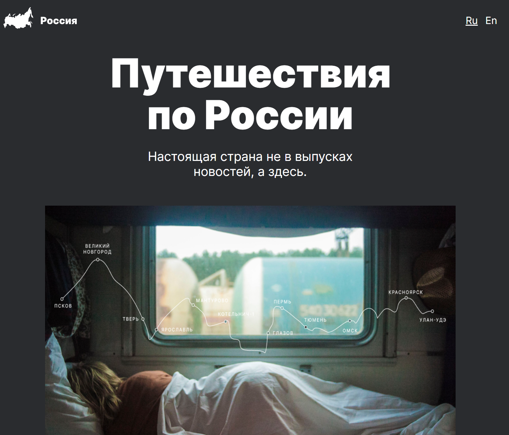

# Проект: Путешествие по России




## Стек:


методологии BEM

Адаптивная верстка под 4 важные точки (1280, 1024, 768, 425)

**Запуск проекта**

Клонируйте репозиторий

```
git clone https://github.com/M0riaz/mesto-project.git
```

###Ссылки и доп. материал

Сайт можно посмотреть по данной [ссылке](<https://m0riaz.github.io/russian-travel/>)

[Ссылка на макет в Figma](https://www.figma.com/file/5S2WSbEFL6awjVWJ0NWL8Q/Sprint-3_-Russia-_-desktop-mobile?node-id=28503%3A0)